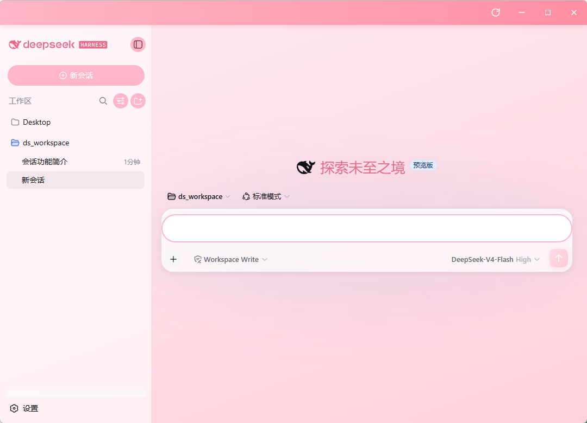
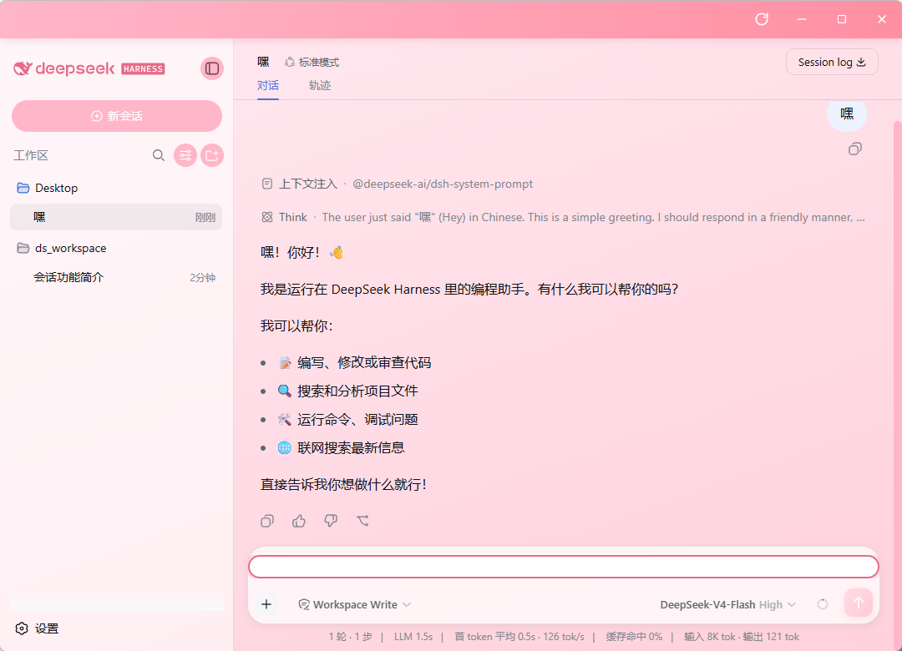

# Pink Whale 🐳

**DeepSeek Harness 的粉色鲸鱼主题桌面套壳**

给 DeepSeek Harness Web（`http://127.0.0.1:3080`）套上一个可爱的粉色鲸鱼外壳：
无边框窗口 + 自绘标题栏 + 全页面 Pink Whale 风格主题注入。

> 图标使用 DeepSeek 鲸鱼 logo 改色而成，主题配色为粉色系（珊瑚粉 `#FF8FA3` / 深粉 `#E86A8A` / 浅粉 `#FFE9F0`）。

---

## ✨ 功能特性

- 🪟 **无边框圆角窗口**：去掉系统标题栏，粉色自绘标题栏 + SVG 按钮（刷新 / 最小化 / 最大化 / 关闭）
- 🐳 **粉色鲸鱼图标**：DSH 蓝鲸 logo 改色为珊瑚粉，窗口图标 + 桌面快捷方式同款
- 🎀 **全页面主题注入**：通过 CSS 注入把 DSH 界面整体粉化（背景、侧边栏、按钮、输入框、滚动条、聊天气泡区域）
- 📥 **iframe 嵌入**：窗口主体直接加载 DeepSeek Harness 真实网页
- 😿 **未运行引导页**：DSH 未启动时显示粉色引导页（提示 `pnpm dsh web` + 重试按钮）
- 🔒 **单实例模式**：重复启动自动聚焦已有窗口，不会开多个
- 🔍 **内置诊断**：标题栏 🌟 按钮可抓取 DSH 页面 DOM 结构，便于后续主题维护

## 📸 截图

**新会话（欢迎页）**



**对话页面**



## ⚙️ 环境要求

- Node.js **22+**（Electron 43 要求）
- npm / pnpm

## 🚀 快速开始

```bash
cd pink_whale
npm install        # 安装依赖（含 Electron 二进制，约 200MB）
npm start          # 启动 Pink Whale（等价 npx electron .）
```

> 前提：DeepSeek Harness 需先运行 `pnpm dsh web`（默认 `http://127.0.0.1:3080`）。
> 未运行时窗口会显示引导页，启动 DSH 后点"重试"即可。

## 🖱️ 桌面快捷方式

桌面的 **`pink_whale.lnk`** 指向：

```
目标：H:\ds_workspace\pink_whale\node_modules\electron\dist\electron.exe
参数："H:\ds_workspace\pink_whale"
图标：pink_whale.ico
```

## 📁 项目结构

```
pink_whale/
├── main.js            # Electron 主进程（无边框窗口、端口检测、主题注入、单实例、IPC）
├── preload.js         # 预加载脚本（窗口控制 / DSH 检测 / 诊断 API）
├── index.html         # 壳界面（自绘标题栏 + 引导页 + DSH iframe）
├── theme.css          # 🎀 Pink Whale 粉色主题（注入到 DSH 页面）
├── diag.js            # 诊断脚本（抓取 DSH 页面结构与元素样式）
├── pink_whale.svg     # 粉色鲸鱼图标源文件（SVG）
├── pink_whale.ico     # 粉色鲸鱼图标（多尺寸）
├── docs/screenshots/  # 界面截图
└── package.json
```

## 🔧 技术说明

- **无边框窗口**：`BrowserWindow({ frame: false })`，标题栏由页面自绘；外层圆角交给 Windows 系统圆角
- **主题注入**：主进程通过 `webContents.executeJavaScript` 向 DSH 的 iframe 注入 `<style id="__whale_theme__">`（内容来自 `theme.css`），每次页面加载自动注入
- **端口检测**：主进程用 `net.connect` 探测 3080 端口，渲染进程通过 IPC 获取状态切换引导页 / iframe
- **单实例**：`app.requestSingleInstanceLock()` 防止多开
- **诊断**：`diag.js` 收集页面标签/类名/颜色/渐变等信息，输出到主进程日志（点 🌟 触发）

## 📜 版本历史

| 版本 | 说明 |
|---|---|
| `f5b63f2` | 标题栏去掉自身圆角，填满窗口顶部两角 |
| `3bf9f93` | 统一更名 hello kitten → pink whale |
| `7bb1ab6` | 粉色鲸鱼图标 + 快捷方式更名 + 冗余清理 |
| `e589a4a` | Hello Kitten MVP（初始版本）|

## 🍬 致谢

- 图标与主题灵感来自 DeepSeek 官方鲸鱼 logo
- 主题配色参考 Pink Whale 粉色系
